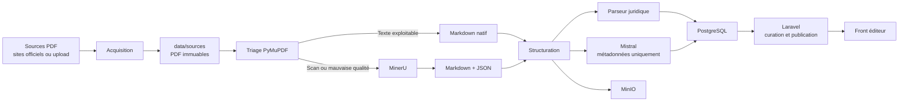
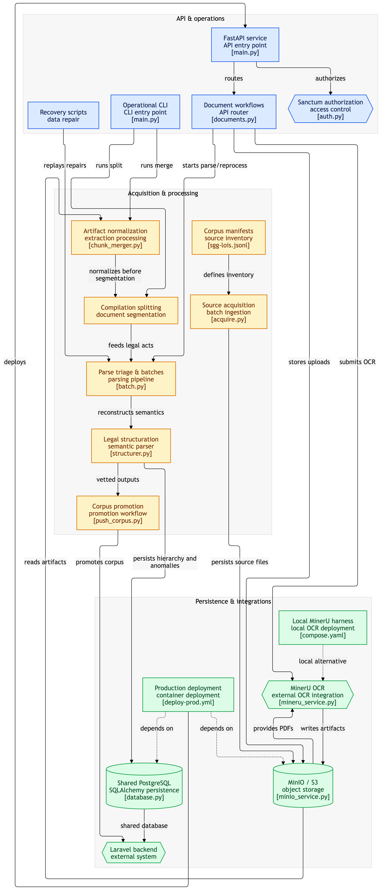
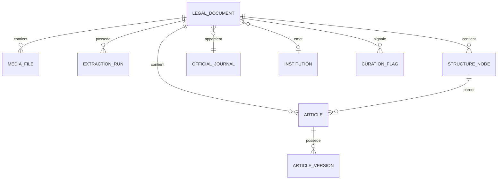

# Architecture technique du fonctionnement de Mibeko Python

`mibeko-python` est un **service interne d’ingestion de textes juridiques** pour le Congo-Brazzaville et l’OHADA. Ce n’est pas le site public Mibeko.

Il reçoit des PDF, extrait leur contenu, reconstruit leur structure juridique, puis écrit le résultat dans PostgreSQL pour qu’il soit relu et publié depuis Laravel.





## 1. Les composants

### Point d’entrée CLI

Le fichier `main.py` contient une CLI Click.

Elle permet notamment de :

- lancer le serveur FastAPI ;
- télécharger et inventorier les sources ;
- traiter un lot de PDF ;
- structurer les documents ;
- fusionner des morceaux MinerU ;
- découper des compilations en actes ;
- rattacher les actes aux Journaux Officiels ;
- effectuer certains diagnostics ou traitements de production.

Exemple :

```bash
python main.py --help
python main.py serve --port 8001
```

### API FastAPI

Le fichier `main.py` est l’orchestrateur HTTP.

Il gère :

- l’upload des documents ;
- la création des runs d’extraction ;
- le lancement des traitements en arrière-plan ;
- le parsing manuel ;
- le retraitement ;
- le flux temps réel SSE ;
- le staging et la promotion des propositions ;
- le health check.

Le routeur `documents.py` expose la consultation des documents, articles, fichiers, statistiques, ainsi que le soft-delete et la restauration.

Endpoints principaux :

```text
GET  /api/v1/health
POST /api/v1/documents/upload
POST /api/v1/documents/{id}/parse
POST /api/v1/documents/{id}/reprocess
GET  /api/v1/documents
GET  /api/v1/documents/{id}/articles
GET  /api/v1/stream
POST /api/v1/documents/{id}/runs/{run}/promote
POST /api/v1/documents/{id}/runs/{run}/discard
```

### Authentification

`auth.py` ne possède pas son propre système d’utilisateurs.

Il lit directement les tables Laravel :

- `personal_access_tokens` ;
- `users` ;
- `roles` ;
- `model_has_roles`.

Le token est un token Sanctum Laravel. Les routes d’ingestion nécessitent généralement un utilisateur ayant le rôle `editor` ou `admin`.

### Acquisition

Le dossier `acquisition` est responsable de la provenance :

- lecture des carnets YAML ;
- téléchargement des PDF ;
- calcul du SHA-256 ;
- création des manifestes JSONL ;
- suivi des statuts de traitement.

Les fichiers importants sont stockés ainsi :

```text
data/
├── corpus/       # configuration du corpus
├── sources/      # PDF originaux, immuables
├── manifests/    # provenance et statuts
└── pipeline/     # artefacts régénérables
```

`sources` est considéré comme immuable. Les fichiers de `pipeline` peuvent être recalculés.

### Triage et parsing des PDF

`triage.py` décide comment traiter un PDF.

Il utilise PyMuPDF pour mesurer :

- le nombre de pages ;
- le nombre de caractères natifs par page ;
- la qualité du texte.

Deux chemins sont possibles :

1. **PDF avec couche texte exploitable**  
   Extraction directe par PyMuPDF, rapide.

2. **PDF scanné ou texte de mauvaise qualité**  
   Passage par MinerU pour OCR et extraction structurée.

L’orchestration batch se trouve dans `batch.py`. Elle est :

- séquentielle ;
- idempotente ;
- reprenable ;
- sauvegardée après chaque document.

### MinerU

`mineru_service.py` fournit une interface commune à deux modes :

- `cloud` : API SaaS MinerU ;
- `local` : serveur MinerU local dans `mineru-local`.

MinerU produit principalement :

- un Markdown ;
- un JSON intermédiaire contenant la structure détectée.

Le Markdown est le format de référence pour reconstruire les actes et les documents. Le JSON sert surtout d’artefact complémentaire et de support pour certaines informations de pagination.

### Parseur juridique

`parser.py` contient `LegalDocumentParser`.

C’est un parseur heuristique basé sur des expressions régulières et des règles métier. Il reconnaît notamment :

- parties ;
- livres ;
- titres ;
- chapitres ;
- sections ;
- paragraphes ;
- articles ;
- préambules ;
- signatures ;
- notes ;
- tableaux ;
- marqueurs de pages.

Il transforme le texte en hiérarchie juridique.

Par exemple :

```text
TITRE I
  CHAPITRE II
    SECTION 1
      ARTICLE 4
      ARTICLE 5
```

Il détecte également certains problèmes :

- trous de numérotation ;
- doublons d’articles ;
- articles sans numéro ;
- structure incohérente ;
- qualité OCR insuffisante.

Ces anomalies deviennent des `CurationFlag`.

### Structuration

Le dossier `structuration` coordonne le parsing final.

`structurer.py` :

1. lit le Markdown ;
2. appelle `LegalDocumentParser` ;
3. extrait le préambule et les articles ;
4. appelle Mistral pour les métadonnées d’en-tête ;
5. valide la réponse ;
6. crée le document et sa hiérarchie ;
7. stocke les artefacts ;
8. crée les articles et versions en base.

Mistral ne doit pas produire le contenu juridique principal. Il sert uniquement aux métadonnées comme :

- nature du texte ;
- numéro ;
- date ;
- autorité ;
- informations d’en-tête.

`batch.py` applique cette logique à tous les documents d’un manifeste.

### Découpage et fusion

Deux composants traitent les gros documents :

- `chunk_merger.py` fusionne plusieurs morceaux MinerU ;
- `compilation_splitter.py` découpe une compilation en actes distincts.

C’est particulièrement important pour les Journaux Officiels, qui contiennent souvent plusieurs textes indépendants.

### Stockage MinIO

`minio_service.py` stocke les fichiers physiques dans MinIO, compatible S3 :

- PDF source ;
- Markdown ;
- JSON MinerU ;
- fichiers issus de retraitements.

PostgreSQL ne stocke donc pas directement les gros fichiers. Il stocke leurs références dans `media_files`.

### Base PostgreSQL

Les modèles SQLAlchemy sont dans `models.py`.

Les principales relations sont :



Les entités principales :

- `LegalDocument` : identité métier du texte ;
- `OfficialJournal` : Journal Officiel parent ;
- `MediaFile` : référence vers MinIO ;
- `ExtractionRun` : historique des traitements ;
- `StructureNode` : arbre juridique ;
- `Article` : identité stable d’un article ;
- `ArticleVersion` : contenu textuel daté ;
- `CurationFlag` : anomalie à vérifier.

Le schéma est **piloté par Laravel**. La fonction `init_db()` de `database.py` ne crée volontairement aucune table.

## 2. Déroulement complet d’une ingestion

### Cas batch

```text
1. Le carnet YAML définit une source
2. Acquisition télécharge le PDF
3. Le PDF est placé dans data/sources/
4. Un manifeste JSONL conserve l’URL, la date et le SHA-256
5. Le triage inspecte le PDF
6. PyMuPDF est utilisé si le texte est exploitable
7. Sinon MinerU réalise l’OCR
8. Les résultats vont dans data/pipeline/
9. Le parseur reconstruit la hiérarchie
10. Mistral enrichit les métadonnées d’en-tête
11. La réponse est validée
12. PostgreSQL reçoit le document, les articles et les versions
13. MinIO conserve les fichiers
14. Laravel effectue la curation et la publication
```

### Cas upload via l’API

L’utilisateur envoie généralement :

- un PDF obligatoire ;
- éventuellement un Markdown ;
- éventuellement un JSON MinerU ;
- des métadonnées comme le type, le rôle ou le code stock.

Deux comportements sont possibles :

- PDF seul : MinerU est lancé en tâche de fond ;
- PDF + artefacts : MinerU est court-circuité.

## 3. STOCK et FLUX

Le champ `document_role` sépare deux familles :

### STOCK

Texte de fond durable :

- code ;
- loi structurante ;
- corpus consolidé.

Il possède généralement un `stock_code`.

### FLUX

Acte ponctuel :

- décret ;
- arrêté ;
- ordonnance ;
- texte extrait d’un Journal Officiel.

Le FLUX peut être rattaché à un `OfficialJournal`.

Ce rôle influence :

- la clé d’unicité ;
- le chemin MinIO ;
- le `type_code` par défaut ;
- la relation avec les Journaux Officiels.

## 4. Curation et publication

Le pipeline Python ne publie pas directement.

Il produit généralement un document en état :

```text
draft -> review -> published
```

Lorsqu’un document déjà curé est retraité, le contenu existant n’est pas écrasé automatiquement. La nouvelle proposition est stockée dans :

```text
extraction_runs.meta.proposed_hierarchy
```

Laravel ou l’éditeur peut ensuite :

- consulter un diff ;
- promouvoir la proposition ;
- la rejeter.

La promotion est donc une décision humaine explicite.

## 5. Relations avec les autres systèmes

### Laravel

Laravel est responsable de :

- la source officielle des migrations ;
- l’authentification Sanctum ;
- les rôles ;
- la curation utilisateur ;
- la publication ;
- une partie du modèle métier.

Python partage la base PostgreSQL avec Laravel, mais ne possède pas le schéma.

### Front éditeur

Le front éditeur appelle l’API Python pour :

- uploader un document ;
- suivre l’avancement ;
- voir les articles ;
- demander un parsing ;
- consulter les anomalies ;
- gérer les retraitements.

Le flux SSE `/api/v1/stream` transmet l’avancement en temps réel.

### MinIO

MinIO contient les fichiers. PostgreSQL contient les métadonnées et relations.

### MinerU

MinerU est un fournisseur d’extraction OCR. Il ne décide pas de la structure métier finale : cette responsabilité appartient au parseur Mibeko.

## 6. Limites importantes

- Les tâches FastAPI utilisent `BackgroundTasks`, sans file durable comme Celery ou RabbitMQ.
- Un redémarrage peut perdre une tâche en cours.
- Le démarrage tente ensuite de marquer les runs orphelins comme échoués.
- Les traitements batch sont séquentiels.
- MinerU local peut être très lent sur CPU/macOS.
- Le schéma PostgreSQL peut dériver des modèles Python, car Laravel est la source d’autorité.
- L’import de MinIO initialise une connexion dès le chargement du module.
- Les documents supprimés sont généralement masqués par soft-delete.
- Les lectures de `legal_documents` et `articles` doivent exclure `deleted_at`.
- Le service de production doit être considéré comme en lecture seule hors opérations explicitement autorisées.

## 7. Comment lire le projet efficacement

Ordre recommandé :

1. `README.md` : rôle général et installation.
2. `architecture.md` : architecture métier.
3. `main.py` : commandes disponibles.
4. `api/main.py` : orchestration HTTP.
5. `parsing/triage.py` : choix natif/MinerU.
6. `parsing/batch.py` et `structuration/batch.py` : traitement des lots.
7. `extractor/parser.py` : grammaire juridique.
8. `structuration/structurer.py` : insertion métier.
9. `db/models.py` : modèle de données.
10. `tests` : comportements réellement verrouillés.

Deux points de documentation sont à garder en tête :

- le port local de développement recommandé est `8001` pour éviter les conflits avec Laravel, même si le port par défaut du code et de Docker est `8000` ;
- la documentation décrit parfois une chaîne `PDF → JSON → Markdown`, mais le code peut utiliser directement l’extraction native PyMuPDF et s’appuie prioritairement sur le Markdown pour la structuration.
